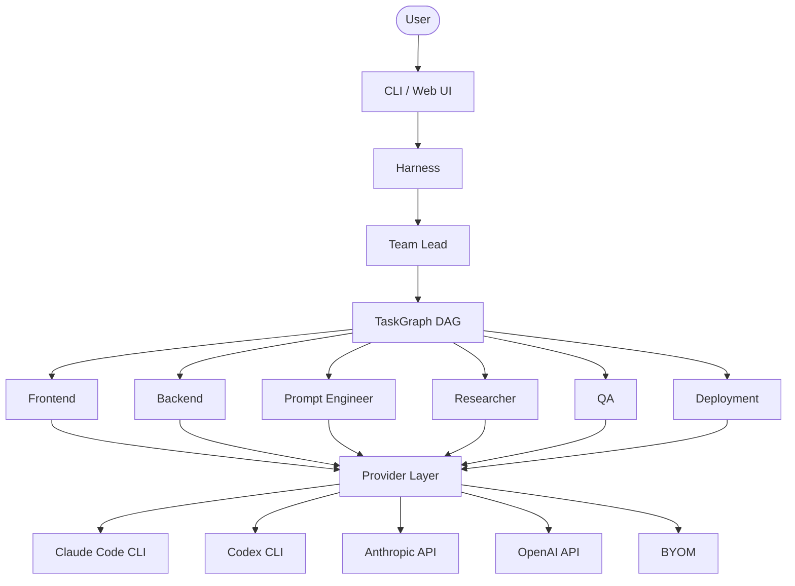

# ch.ai

[](https://www.python.org/downloads/)
[](https://opensource.org/licenses/MIT)

AI engineering team harness — orchestrate specialized agents with roles, feedback loops, and self-improvement.

## What is ch.ai?

ch.ai is an AI engineering team harness that runs multiple specialized agents in coordinated roles. Instead of a single generalist model, you get a Team Lead that decomposes tasks, Backend and Frontend specialists that implement code, QA that validates, and more. Each agent has access to the right tools and context for its role.

ch.ai makes the "engineering team" metaphor concrete: a Team Lead decomposes your prompt into a task graph (DAG), agents execute tasks in parallel respecting dependencies, and a validation gate runs tests and lint between execution and review. Golden principles in `docs/golden-principles/` enforce code standards mechanically.

What's different: ch.ai is a harness you run locally or in CI. You configure which providers (Claude Code CLI, Codex CLI, Anthropic API, OpenAI API, or any OpenAI-compatible endpoint) power each role. Plans are first-class artifacts in `docs/exec-plans/`. The system improves itself by tracking quality scores and updating principles after runs.

## Quick Start

### 1. Clone and set up a virtual environment

```bash
git clone git@github.com:Nishchaie/ch.ai.git
cd ch.ai
```

**macOS / Linux:**

```bash
python3 -m venv .venv
source .venv/bin/activate
pip install -e ".[dev]"
```

**Windows (PowerShell):**

```powershell
python -m venv .venv
.\.venv\Scripts\Activate.ps1
pip install -e ".[dev]"
```

**With conda (alternative):**

```bash
conda create -n chai python=3.12 -y
conda activate chai
pip install -e ".[dev]"
```

### 2. Configure a provider

ch.ai needs at least one AI provider. Pick the one you have:

**Option A -- Claude Code CLI (recommended, easiest):**

```bash
npm install -g @anthropic-ai/claude-code
```

**Option B -- Anthropic API key:**

```bash
export ANTHROPIC_API_KEY="sk-ant-..."
# Or persist it:
chai config set keys.anthropic_api "sk-ant-..."
```

**Option C -- OpenAI API key:**

```bash
export OPENAI_API_KEY="sk-..."
chai config set keys.openai_api "sk-..."
chai config set default_provider openai_api
chai config set default_model gpt-4-turbo      # or gpt-4
```

**Option D -- Bring Your Own Model (any OpenAI-compatible API):**

```bash
chai config set custom_base_url "http://localhost:11434/v1"
chai config set custom_model "llama3"
chai config set default_provider custom

```

### 3. Initialize and run

```bash
cd /path/to/your/project
chai init
chai run "Add a health endpoint to the API"
```

### Verify installation

```bash
chai --help          # Should show all commands
chai config show     # Should show your config
python -m pytest     # Should pass all tests (from the ch.ai repo)
```

## Architecture

```
User → CLI → Harness → Team Lead → TaskGraph → Roles → Providers → Tools
```

See `docs/architecture-diagram.md` for full Mermaid diagrams exportable to SVG.



## Team Roles

| Role | Description | Autonomy | Tools | Context Scope |
|------|-------------|----------|-------|---------------|
| Lead | Decomposes prompts into task DAG, coordinates, reviews | High | All | Full project (`*.md`, `docs/`, `AGENTS.md`) |
| Frontend | UI, components, styling, client-side logic | Medium | All | `*.tsx`, `*.ts`, `*.jsx`, `*.js`, `frontend/`, `components/` |
| Backend | APIs, data models, server-side logic | Medium | All | `*.py`, `api*.py`, `models/`, `src/` |
| Prompt | Prompt engineering, LLM integration, AGENTS.md | Medium | Read, write, edit, grep, search | `*prompt*`, `prompts/`, `templates/` |
| Researcher | Search, docs review, tradeoff analysis | Medium | Read-only + search | `*.md`, `docs/`, `references/` |
| QA | Tests, lint, validation, bug reproduction | Medium | Read, write, edit, shell, browser, review | `test*.py`, `*_test.*`, `tests/`, `*.py` |
| Deployment | CI/CD, Docker, deployment scripts, monitoring | Medium | All | `Dockerfile*`, `.github/`, `Makefile`, `pyproject.toml` |

Roles are extensible via `RoleRegistry`. Add custom roles like `SecurityEngineer`, `DataEngineer`, or `MLEngineer` with their own tool access, system prompt, and autonomy level.

## CLI Reference

| Command | Description |
|---------|-------------|
| `chai init` | Initialize project: creates `chai.yaml`, `AGENTS.md`, `docs/` structure |
| `chai run <prompt>` | Run a full team on a task (`-p` provider, `-m` model, `--max-agents`) |
| `chai agent --role <role> <prompt>` | Run a single agent with a specific role (`-p` provider, `-m` model) |
| `chai team create` | Interactive team creation |
| `chai team status` | Show current team status |
| `chai plan create <prompt>` | Create an execution plan |
| `chai plan run <path>` | Execute an existing plan |
| `chai plan status <path>` | Check plan progress |
| `chai config show` | Show current config |
| `chai config set <key> <value>` | Set a config value |
| `chai quality` | Show quality scores per domain |
| `chai garden` | Run the doc gardener (find stale docs, broken links) |
| `chai api` | Start the FastAPI server for the web frontend (`--host`, `--port`, `-d` project dir) |
| `chai interactive` | Interactive REPL — build, iterate, and manage plans in a persistent session |

### Interactive Mode Commands

Inside `chai interactive`, the following slash commands are available:

| Command | Description |
|---------|-------------|
| `<plain text>` | Execute the prompt through the Harness (same as `/run`) |
| `/run <prompt>` | Explicitly run a prompt |
| `/plan` | Show the latest plan's task board |
| `/plan create <prompt>` | Create an execution plan |
| `/plan run <path>` | Execute an existing plan |
| `/history` | Show runs in the current session |
| `/new` | Start a new session (clears context, creates new DB session) |
| `/clear` | Clear session context without creating a new DB session |
| `/team` | Show team status |
| `/config` | Show config |
| `/quality` | Show quality scores |
| `/help` | Show all commands |
| `/quit` | Exit interactive mode |

Session context threads across prompts: after each run, a summary of what was done is prepended to the next prompt so the agent can iterate on prior work. Ctrl+C during a run cancels it and returns to the prompt. Ctrl+D exits.

## Configuration

### chai.yaml (per-project)

```yaml
team:
  name: my-project-team
  max_concurrent_agents: 4
  default_provider: claude_code
  workspace_mode: worktree             # "worktree" or "shared"
  members:
    lead:
      provider: claude_code
      autonomy: high
    frontend:
      provider: claude_code
    backend:
      provider: anthropic_api
      model: claude-sonnet-4-6
    qa:
      provider: claude_code

validation:
  run_tests: true
  test_command: "pytest -x"            # auto-detected if omitted
  run_linter: true
  boot_app: false                      # set true for web apps
  boot_command: "python -m app"
  health_check_url: "http://localhost:8000/health"
  browser_checks: false
  max_fix_iterations: 3

self_improvement:
  update_principles_after_run: true
  garbage_collect_schedule: "manual"   # "daily", "after_each_run", "weekly", "manual"
  track_quality_scores: true
```

### ~/.chai/config.json (global)

Stores global settings. Managed via `chai config set`.

| Key | Default | Description |
|-----|---------|-------------|
| `default_provider` | `claude_code` | Provider used when not overridden per-role |
| `default_model` | `claude-sonnet-4-6` | Model used when not specified |
| `theme` | `default` | Terminal UI theme |
| `verbose` | `false` | Verbose output |
| `keys` | `{}` | API keys per provider (`anthropic_api`, `openai_api`) |
| `max_concurrent_agents` | `4` | Max parallel agents |
| `custom_base_url` | -- | Base URL for BYOM provider |
| `custom_model` | -- | Model name for BYOM provider |

Context compaction settings (automatic summarization when nearing token limits):

| Key | Default | Description |
|-----|---------|-------------|
| `context_compact_threshold` | `0.8` | Fraction of context window that triggers compaction |
| `context_keep_head_ratio` | `0.2` | Fraction of context preserved from the start |
| `context_keep_tail_ratio` | `0.2` | Fraction of context preserved from the end |
| `context_compact_cooldown_messages` | `8` | Min messages between compactions |
| `context_compact_min_messages` | `12` | Min messages before compaction can trigger |
| `context_reserved_output_tokens` | `8192` | Tokens reserved for model output |

## Building a Complex Project

Here's a walkthrough of using ch.ai to build a full-stack SaaS app from scratch, showing how the team-based approach handles real complexity.

### Step 1 -- Bootstrap the project

```bash
mkdir my-saas && cd my-saas
git init
chai init
```

This creates `chai.yaml`, `AGENTS.md`, and the `docs/` structure. Edit `chai.yaml` to configure your team:

```yaml
team:
  name: saas-team
  max_concurrent_agents: 4
  members:
    lead:
      provider: claude_code
      autonomy: high
    frontend:
      provider: claude_code
    backend:
      provider: claude_code
    qa:
      provider: claude_code
    deployment:
      provider: claude_code

validation:
  run_tests: true
  boot_app: true
  boot_command: "python -m uvicorn app.main:app --port 8080"
  health_check_url: "http://localhost:8080/health"
```

### Step 2 -- Scaffold the application

```bash
chai run "Create a FastAPI backend with SQLite, a React frontend with Tailwind, 
and a shared types package. Include a health endpoint, basic project structure, 
and a Makefile for common tasks."
```

What happens internally:
- **Team Lead** decomposes this into ~4 tasks: backend scaffold, frontend scaffold, shared types, Makefile
- **Backend Engineer** creates the FastAPI app with SQLite and health endpoint
- **Frontend Engineer** scaffolds React + Tailwind with Vite
- **QA** writes initial smoke tests
- **Validation gate** runs tests and checks the health endpoint boots

### Step 3 -- Build a feature end-to-end

```bash
chai run "Build user authentication: registration, login, logout, and password reset. 
Use JWT tokens. The frontend should have login and registration forms. 
Include tests for all auth endpoints."
```

The Team Lead creates a task DAG with dependencies:

```
be-auth (Backend) ──→ fe-auth (Frontend) ──→ qa-auth (QA)
       └──────────────────────────────────→ qa-auth
```

Backend builds the auth API first. Frontend builds the UI once the API exists. QA writes tests after both are done. All agents work in isolated git worktrees.

### Step 4 -- Iterate with single agents for focused work

Not everything needs the full team. Use single-agent mode for targeted tasks:

```bash
# Quick backend change
chai agent --role backend "Add rate limiting to the auth endpoints, 
max 5 login attempts per minute per IP"

# Frontend polish
chai agent --role frontend "Add form validation to the login page, 
show inline errors, disable submit while loading"

# Research before a big decision
chai agent --role researcher "Compare Stripe vs Paddle for payment integration. 
Consider pricing, API quality, and international support. Write findings to docs/references/payments.md"
```

### Step 5 -- Use execution plans for large features

For complex multi-step work, create a plan first:

```bash
chai plan create "Add a subscription billing system with Stripe: 
plans page, checkout flow, webhook handling, subscription management, 
usage tracking, and billing portal"
```

This generates a plan in `docs/exec-plans/active/` with tasks, dependencies, and acceptance criteria. Review it, then execute:

```bash
# Review the plan
chai plan status docs/exec-plans/active/subscription-billing.md

# Execute it (the team works through the plan step by step)
chai plan run docs/exec-plans/active/subscription-billing.md
```

### Step 6 -- Build and iterate in interactive mode

Interactive mode gives you a persistent session where each prompt carries context from prior runs. Type plain text to execute, or use slash commands for control.

```bash
chai interactive

# Plain text runs through the full pipeline
> Add email notifications for subscription events
# ▸ planning → executing → reviewing → Done. (45s)

# Next prompt knows what you just built
> Fix the notification template formatting
# The agent sees session history and builds on top of the previous work

# Create a plan without executing it
> /plan create Add admin dashboard

# Session management
> /history          # see what you've done this session
> /new              # start fresh (clears context)
> /clear            # clear context without starting a new DB session

# Other commands
> /team             # team status
> /plan             # show latest plan's task board
> /plan run <path>  # execute a plan
> /config           # show config
> /quality          # quality scores
> /help             # list all commands
> /quit             # exit
```

Context threading means the second prompt "Fix the notification template formatting" is aware of the email notification code created by the first prompt. The agent receives a session history summary so it can iterate on prior work without re-explaining the full context.

Long sessions are automatically compacted to stay within token limits.

### Step 7 -- Maintain quality as you grow

```bash
# Check quality scores across domains
chai quality

# Run the doc gardener to find stale docs and broken links
chai garden
```

### Step 8 -- Use the web dashboard for visibility

```bash
# Terminal 1
chai api

# Terminal 2
cd frontend && npm run dev
```

Open http://localhost:5173 to see the kanban task board, live agent output, plan progress, and quality scores in real time.

### Tips for complex projects

- **Start with `chai run` for features, `chai agent` for fixes.** Team mode shines for multi-file, multi-concern work. Single-agent mode is faster for focused changes.
- **Write golden principles early.** Add rules to `docs/golden-principles/index.md` about your project's patterns (API response format, component structure, error handling). The agents will follow them mechanically.
- **Use the Researcher role before big decisions.** Have it analyze tradeoffs and write findings to `docs/references/` before committing to an approach.
- **Let QA run continuously.** Keep `validation.run_tests: true` so every change is tested before review. The self-fix loop catches most issues automatically.
- **Track quality over time.** `chai quality` shows scores per domain. Regressions trigger targeted fix tasks.

## Self-Testing and Self-Improvement

The validation gate runs automatically between execution and review:

1. **Tests** -- detects the test framework and runs the suite
2. **Linting** -- checks golden principles against changed files
3. **Boot check** -- if configured, starts the app and hits the health endpoint
4. **Browser check** -- if configured, navigates the running app via CDP

If any check fails, the harness creates fix tasks routed back to the original agent and retries, up to `max_fix_iterations` (default 3).

After each run, the Prompt Engineer role can update `AGENTS.md` and golden principles based on what worked and what failed. The Garbage Collector finds pattern drift, duplicated code, and dead imports. Quality scores track progress over time in `docs/QUALITY_SCORE.md`.

## Frontend Dashboard

The web dashboard provides real-time team status, a kanban task board, live agent console with role-colored output, execution plan viewer, and quality score tracking.

| Component | Purpose |
|-----------|---------|
| AgentConsole | Chat-style console with prompt input, live agent events, and tool call display |
| TeamView | Role cards with provider, model, and active/idle status |
| TaskBoard | Kanban columns: Pending, In Progress, Reviewing, Completed, Failed |
| PlanViewer / PlanDetail | Browse execution plans and drill into task details |
| QualityDashboard | Quality scores per domain with grade styling |
| ActivityBanner | Phase indicator (planning, executing, reviewing) during runs |

```bash
# Terminal 1 -- start the API server
chai api

# Terminal 2 -- start the frontend
cd frontend
npm install        # first time only
npm run dev
```

Open [http://localhost:5173](http://localhost:5173). The frontend proxies `/api` to the backend on port 8000.

## Development

```bash
# Run tests
pytest                    # All tests
pytest tests/core/        # Just core engine tests
pytest tests/providers/   # Just provider tests
pytest -v --tb=short      # Verbose with short tracebacks

# Frontend dev
cd frontend && npm install && npm run dev
# (start chai api in another terminal for the backend)
```

### Project structure

```
src/chai/
  core/           Team engine: harness, team, roles, agents, tasks, context
  providers/      Model providers: Claude Code, Codex, Anthropic API, OpenAI API, BYOM
  tools/          Agent tools: filesystem, grep, shell, browser, review, search
  orchestration/  Coordination: scheduling, planning, feedback loops, merge, worktrees, validation
  knowledge/      Repository knowledge: scanning, AGENTS.md, doc gardening
  quality/        Enforcement: golden principles, quality scoring, linting, garbage collection
  sessions/       Persistence: SQLite sessions, history, context compaction
  ui/             Terminal UI: rich output, dashboard, themes
  cli.py          CLI entry point (click)
  api.py          FastAPI server for the web frontend
  config.py       Global (~/.chai/config.json) and per-project (chai.yaml) configuration
  state.py        Runtime state management
  types.py        Shared types, enums, and Pydantic models
frontend/         React/TypeScript web dashboard
docs/             System of record: design docs, exec plans, golden principles, references
tests/            Test suite (mirrors src/ structure)
```

## Troubleshooting

**`command not found: chai`** -- Make sure your virtual environment is activated (`source .venv/bin/activate`) and you've installed the package (`pip install -e ".[dev]"`).

**`No API key found`** -- Set a provider key via environment variable (`export ANTHROPIC_API_KEY=...`) or config (`chai config set keys.anthropic_api ...`). If using Claude Code CLI, run `claude` once to authenticate.

**`pip: command not found`** -- Use `pip3` instead, or ensure your venv is activated. On some systems `python3 -m pip install -e .` works when `pip` alone doesn't.

**Tests fail with import errors** -- Reinstall: `pip install -e ".[dev]"`. Ensure you're running from the ch.ai repo root with the venv active.

**Frontend won't connect to API** -- Start the API server first (`chai api`), then the frontend (`cd frontend && npm run dev`). The proxy in `vite.config.ts` forwards `/api` to `localhost:8000`.

## Terminology

| Blog Term | ch.ai Concept |
|-----------|---------------|
| Harness | `Harness` class — runtime environment + orchestration |
| Engineering team | `Team` (Lead + specialized roles) |
| Task decomposition | `TaskDecomposer`, `TaskGraph` (DAG) |
| Specialist agents | `AgentRunner` per role |
| AGENTS.md as map | `AGENTS.md` — ~100-line table of contents pointing to `docs/` |
| Execution plans | `docs/exec-plans/`, `ExecutionPlanManager` |
| Golden principles | `docs/golden-principles/`, `GoldenPrincipleChecker` |
| Garbage collection | `GarbageCollector` — recurring cleanup agent |
| Feedback loops | `FeedbackLoop` — agent-to-agent review cycle |
| Validation gate | `ValidationGate` — tests/lint/boot between execution and review |
| Increasing autonomy | `AutonomyLevel` enum (READ_ONLY, MEDIUM, HIGH, FULL) |
