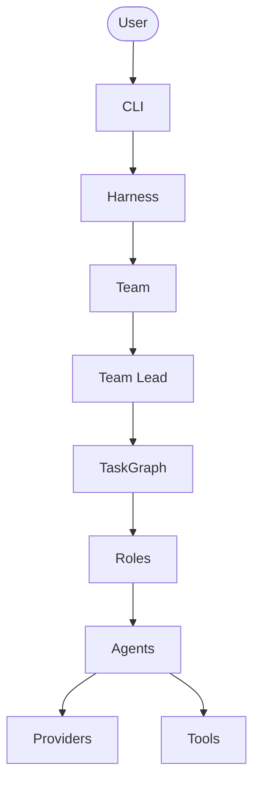
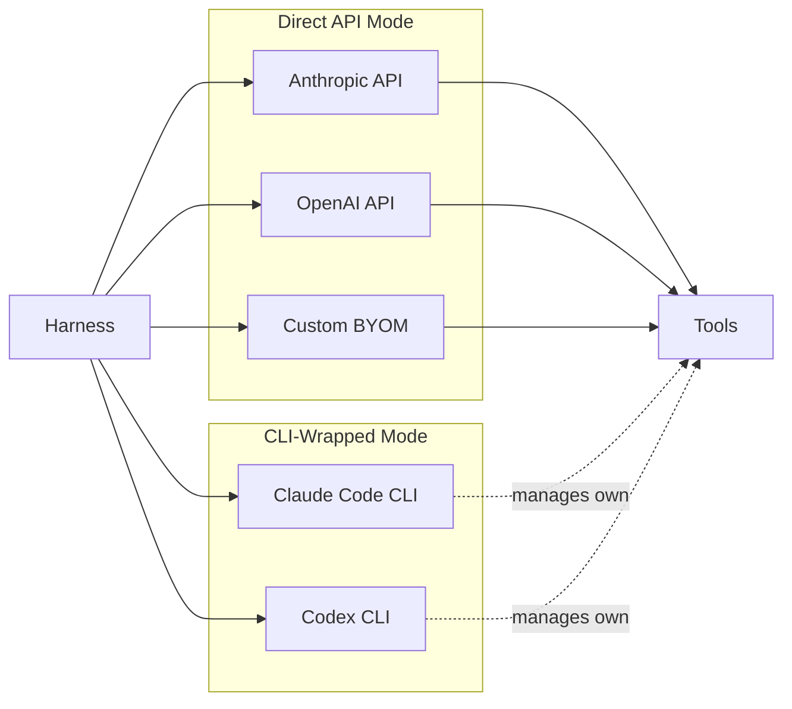
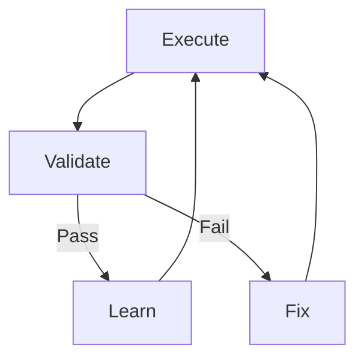

# ch.ai Architecture Diagrams

Standalone Mermaid diagrams for ch.ai system architecture.

## 1. System Overview Flowchart



## 2. Provider Architecture



## 3. Self-Improvement Loop



## Rendering to SVG

Use Mermaid CLI to export diagrams:

```bash
mmdc -i docs/architecture-diagram.md -o docs/architecture.svg -t dark
```

Requires: `npm install -g @mermaid-js/mermaid-cli`
